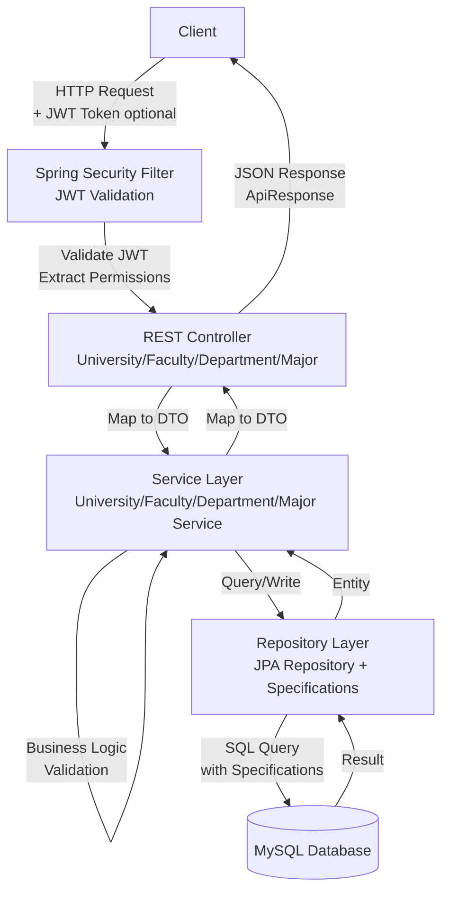
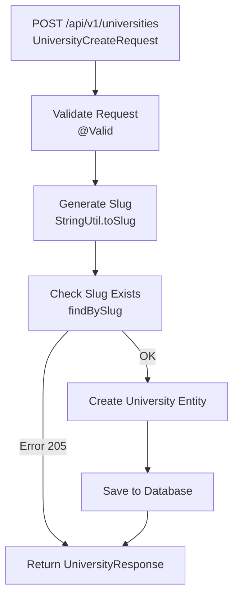
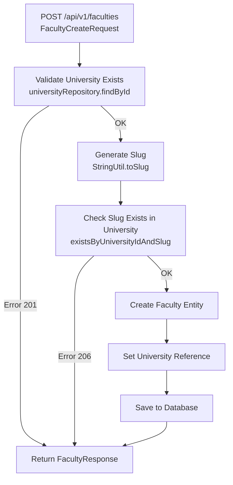
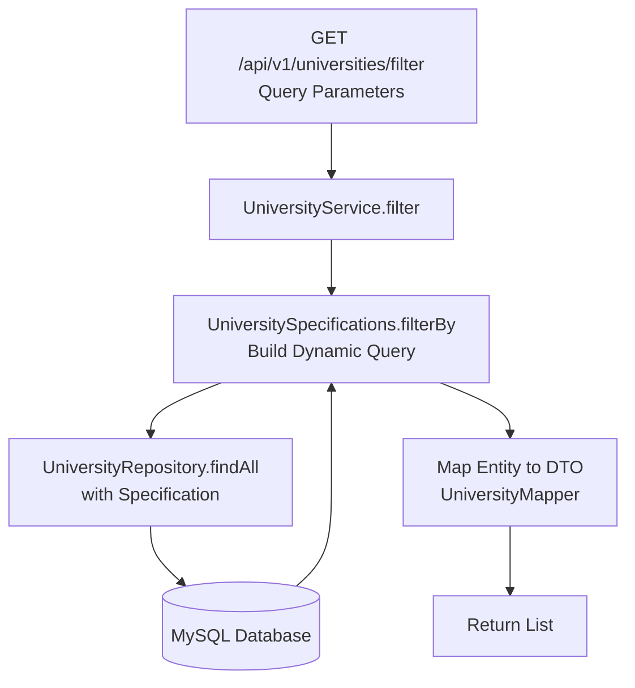
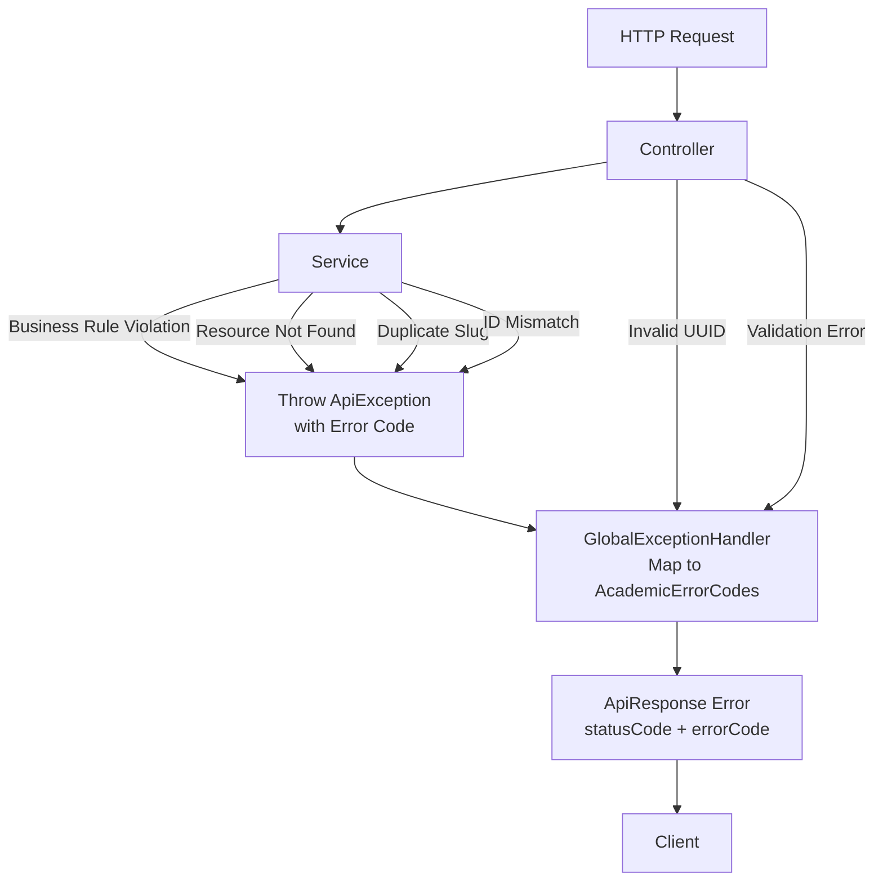
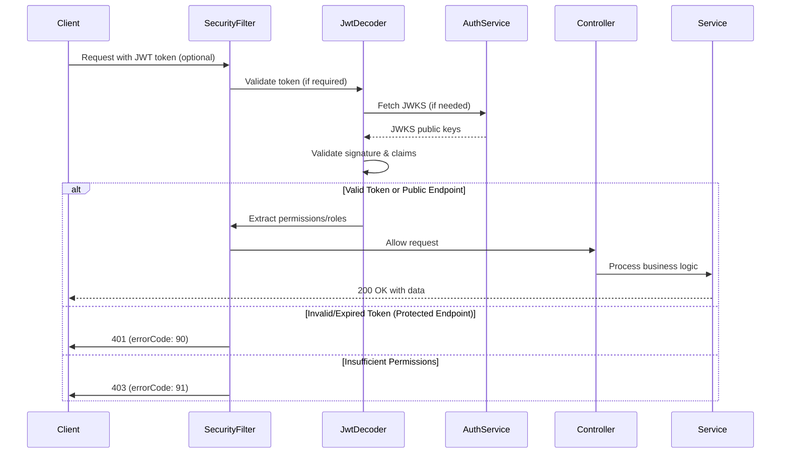
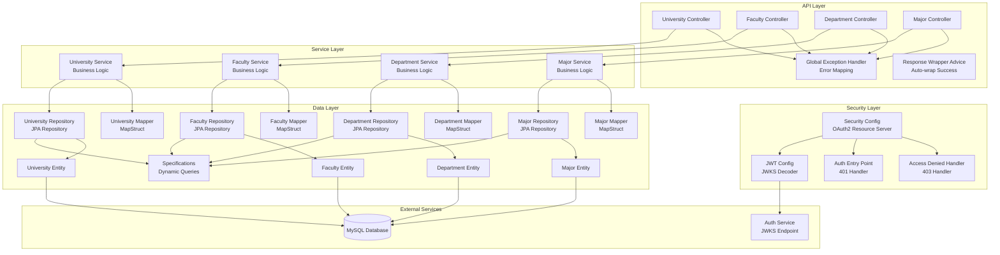

# Academic Service

**AcademicService** là microservice quản lý thông tin học thuật trong hệ thống **StudyDocs**, bao gồm quản lý trường đại học (University), khoa (Faculty), bộ môn (Department), và ngành học (Major).  
Dịch vụ hỗ trợ CRUD operations cho các entity học thuật, filter/search với query parameters, quản lý slug tự động, và tích hợp OAuth2 JWT authentication.

---
- Port: **8083** 
- Database: MySQL (cấu hình qua environment variables)
- API base URLs: 
  - `http://localhost:8083/api/v1/universities`
  - `http://localhost:8083/api/v1/faculties`
  - `http://localhost:8083/api/v1/departments`
  - `http://localhost:8083/api/v1/majors`

## 1. Giới thiệu

- **Mục đích**: Quản lý thông tin học thuật phân cấp (University → Faculty → Department → Major) trong hệ thống StudyDocs.
- **Đặc điểm nổi bật**:
  - Quản lý phân cấp học thuật: University → Faculty → Department → Major
  - CRUD operations đầy đủ cho tất cả entities
  - Filter/search với query parameters linh hoạt
  - Slug tự động từ tên (URL-friendly)
  - Validation business rules (slug uniqueness, ID mismatch, hierarchy validation)
  - Error code system (200-299 range) với standardized ApiResponse
  - Tích hợp OAuth2 Resource Server với JWT authentication
  - UUID-based primary keys và foreign keys
  - Database migration với Flyway
  - JPA Specifications cho dynamic queries

---

## 2. Chức năng chi tiết

### University Management
1. **Tạo trường đại học** - Tạo mới university với slug tự động từ tên.
2. **Lấy thông tin university** - Theo ID hoặc slug.
3. **Cập nhật university** - Theo ID hoặc slug.
4. **Xóa university** - Theo ID hoặc slug (cascade delete xuống Faculty).
5. **Filter universities** - Lọc theo id, slug, isActive.

### Faculty Management
6. **Tạo khoa** - Tạo mới faculty thuộc một university, slug tự động.
7. **Lấy thông tin faculty** - Theo ID.
8. **Cập nhật faculty** - Theo ID hoặc slug (yêu cầu universityId để validate).
9. **Xóa faculty** - Theo ID hoặc slug (yêu cầu universityId để validate, cascade delete xuống Department).
10. **Filter faculties** - Lọc theo universityId, universitySlug, isActive.

### Department Management
11. **Tạo bộ môn** - Tạo mới department thuộc một faculty, slug tự động.
12. **Lấy thông tin department** - Theo ID.
13. **Cập nhật department** - Theo ID hoặc slug (yêu cầu universityId và facultyId để validate).
14. **Xóa department** - Theo ID hoặc slug (yêu cầu universityId và facultyId để validate, cascade delete xuống Major).
15. **Filter departments** - Lọc theo universityId, universitySlug, facultyId, facultySlug, isActive.

### Major Management
16. **Tạo ngành học** - Tạo mới major thuộc một department, slug tự động.
17. **Lấy thông tin major** - Theo ID.
18. **Cập nhật major** - Theo ID hoặc slug (yêu cầu universityId và departmentId để validate).
19. **Xóa major** - Theo ID hoặc slug (yêu cầu universityId và departmentId để validate).
20. **Filter majors** - Lọc theo universityId, universitySlug, facultyId, facultySlug, departmentId, departmentSlug, isActive.

### Business Rules & Validation
21. **Slug uniqueness** - Slug phải unique trong cùng một parent entity (error codes 205-208).
22. **ID mismatch validation** - Validate resource thuộc về đúng parent entity (error codes 209-212).
23. **Invalid UUID format** - Validation UUID format trong request (error code 213).
24. **Resource not found** - Validation khi resource không tồn tại (error codes 201-204).

### Security & Authentication
25. **JWT Authentication** - Một số endpoints yêu cầu JWT token hợp lệ từ auth service.
26. **OAuth2 Resource Server** - Tích hợp Spring Security OAuth2 với JWKS endpoint.
27. **Permission-based Authorization** - Hỗ trợ @PreAuthorize với permissions từ JWT claims.

---

## 3. Cấu trúc thư mục (CHỈ CẤP FOLDER — KHÔNG LIỆT KÊ FILE)

```text
src/main/java/com/example/academicservice/
├── config              → Cấu hình Security, JWT, Response Wrapper
├── controller          → REST Controllers (University, Faculty, Department, Major)
├── dto
│   ├── request        → Request DTOs
│   └── response       → Response DTOs
├── entity              → JPA Entities (University, Faculty, Department, Major)
├── exception           → Custom Exceptions, Error Codes, Global Exception Handler
├── mapper              → MapStruct Mappers (DTO ↔ Entity)
├── repository
│   ├── specification   → JPA Specifications cho dynamic queries
│   └── *.java         → Spring Data JPA Repositories
├── service             → Business Logic Services
├── service/util        → Utility classes (StringUtil cho slug generation)
└── web                 → ApiResponse wrapper
```

---

## 4. Công nghệ & Thư viện sử dụng

| Công nghệ / Thư viện                              | Tác dụng                                           | Link tham khảo                                      |
|---------------------------------------------------|--------------------------------------------------|----------------------------------------------------|
| Spring Boot 3.2.5                                 | Framework chính, auto-configuration             | [spring.io](https://spring.io/projects/spring-boot) |
| Spring Web                                        | Xây dựng REST API                                | [spring.io](https://spring.io/projects/spring-web) |
| Spring Data JPA                                   | ORM, quản lý entity, query                       | [spring.io](https://spring.io/projects/spring-data-jpa) |
| Spring Security OAuth2 Resource Server            | JWT authentication và authorization             | [spring.io](https://spring.io/projects/spring-security) |
| MySQL                                             | Database chính (relational database)            | [mysql.com](https://www.mysql.com)                |
| Flyway                                            | Database migration và version control           | [flywaydb.org](https://flywaydb.org)              |
| MapStruct 1.5.5.Final                             | Automatic mapping giữa DTO và Entity            | [mapstruct.org](https://mapstruct.org)             |
| Lombok                                             | Giảm boilerplate (getter, setter, @RequiredArgsConstructor, ...) | [projectlombok.org](https://projectlombok.org) |
| Hibernate                                          | JPA implementation, ORM framework                | [hibernate.org](https://hibernate.org)             |
| JPA Specifications                                | Dynamic query building                            | [Spring Data JPA](https://spring.io/projects/spring-data-jpa) |

---

## 5. Sơ đồ luồng xử lý (Architecture & Request Flow)

### 5.1. Request Flow (HTTP Request)



### 5.2. Create University Flow



### 5.3. Create Faculty Flow (with University Validation)



### 5.4. Filter Flow (Dynamic Query)



### 5.5. Error Handling Flow



### 5.6. JWT Authentication Flow



### 5.7. Component Overview



---

## 6. Error Codes

### Academic Error Codes (200-299)
- **201**: UNIVERSITY_NOT_FOUND - Không tìm thấy trường đại học
- **202**: FACULTY_NOT_FOUND - Không tìm thấy khoa
- **203**: DEPARTMENT_NOT_FOUND - Không tìm thấy bộ môn
- **204**: MAJOR_NOT_FOUND - Không tìm thấy ngành học
- **205**: UNIVERSITY_SLUG_EXISTS - Slug trường đại học đã tồn tại
- **206**: FACULTY_SLUG_EXISTS - Slug khoa đã tồn tại
- **207**: DEPARTMENT_SLUG_EXISTS - Slug bộ môn đã tồn tại
- **208**: MAJOR_SLUG_EXISTS - Slug ngành học đã tồn tại
- **209**: UNIVERSITY_ID_MISMATCH - University ID không khớp
- **210**: FACULTY_ID_MISMATCH - Faculty ID không khớp
- **211**: DEPARTMENT_ID_MISMATCH - Department ID không khớp
- **212**: MAJOR_ID_MISMATCH - Major ID không khớp
- **213**: INVALID_UUID - UUID format không hợp lệ
- **299**: UNKNOWN_ACADEMIC_ERROR - Lỗi academic không xác định (fallback)

### Auth Error Codes (0-99)
- **90**: ACCESS_TOKEN_INVALID_OR_EXPIRED - JWT token không hợp lệ/hết hạn
- **91**: FORBIDDEN - Không đủ quyền truy cập

### Common Error Codes (100-199, 500)
- **100**: VALIDATION_FAILED - Validation failed (@NotNull, etc.)
- **101**: BAD_REQUEST - Bad request chung
- **500**: INTERNAL_ERROR - Server error

Chi tiết đầy đủ xem file [ERROR_CODES.md](./ERROR_CODES.md)

---

## 7. API Endpoints

### Universities

| Method | Endpoint | Description | Auth Required |
|--------|----------|-------------|---------------|
| GET | `/api/v1/universities/id/{id}` | Lấy university theo ID | ✅ (SCOPE_READ_USER) |
| GET | `/api/v1/universities/filter` | Filter universities | ✅ (SCOPE_READ_USER) |
| POST | `/api/v1/universities` | Tạo mới university | ❌ |
| PUT | `/api/v1/universities/id/{id}` | Cập nhật university theo ID | ❌ |
| PUT | `/api/v1/universities/slug/{slug}` | Cập nhật university theo slug | ❌ |
| DELETE | `/api/v1/universities/id/{id}` | Xóa university theo ID | ❌ |
| DELETE | `/api/v1/universities/slug/{slug}` | Xóa university theo slug | ❌ |

### Faculties

| Method | Endpoint | Description | Auth Required |
|--------|----------|-------------|---------------|
| GET | `/api/v1/faculties/id/{id}` | Lấy faculty theo ID | ❌ |
| GET | `/api/v1/faculties/filter` | Filter faculties | ❌ |
| POST | `/api/v1/faculties` | Tạo mới faculty | ❌ |
| PUT | `/api/v1/faculties/id/{id}?universityId={uuid}` | Cập nhật faculty theo ID | ❌ |
| PUT | `/api/v1/faculties/slug/{slug}?universityId={uuid}` | Cập nhật faculty theo slug | ❌ |
| DELETE | `/api/v1/faculties/id/{id}?universityId={uuid}` | Xóa faculty theo ID | ❌ |
| DELETE | `/api/v1/faculties/slug/{slug}?universityId={uuid}` | Xóa faculty theo slug | ❌ |

### Departments

| Method | Endpoint | Description | Auth Required |
|--------|----------|-------------|---------------|
| GET | `/api/v1/departments/id/{id}` | Lấy department theo ID | ❌ |
| GET | `/api/v1/departments/filter` | Filter departments | ❌ |
| POST | `/api/v1/departments` | Tạo mới department | ❌ |
| PUT | `/api/v1/departments/id/{id}?universityId={uuid}` | Cập nhật department theo ID | ❌ |
| PUT | `/api/v1/departments/slug/{slug}?universityId={uuid}&facultyId={uuid}` | Cập nhật department theo slug | ❌ |
| DELETE | `/api/v1/departments/id/{id}?universityId={uuid}` | Xóa department theo ID | ❌ |
| DELETE | `/api/v1/departments/slug/{slug}?universityId={uuid}&facultyId={uuid}` | Xóa department theo slug | ❌ |

### Majors

| Method | Endpoint | Description | Auth Required |
|--------|----------|-------------|---------------|
| GET | `/api/v1/majors/id/{id}` | Lấy major theo ID | ❌ |
| GET | `/api/v1/majors/filter` | Filter majors | ❌ |
| POST | `/api/v1/majors` | Tạo mới major | ❌ |
| PUT | `/api/v1/majors/id/{id}?universityId={uuid}` | Cập nhật major theo ID | ❌ |
| PUT | `/api/v1/majors/slug/{slug}?universityId={uuid}&departmentId={uuid}` | Cập nhật major theo slug | ❌ |
| DELETE | `/api/v1/majors/id/{id}?universityId={uuid}` | Xóa major theo ID | ❌ |
| DELETE | `/api/v1/majors/slug/{slug}?universityId={uuid}&departmentId={uuid}` | Xóa major theo slug | ❌ |

---

## 8. Database Schema

### Universities Table
```sql
CREATE TABLE universities (
    id CHAR(36) NOT NULL PRIMARY KEY,
    name VARCHAR(255) NOT NULL UNIQUE,
    slug VARCHAR(100) NOT NULL UNIQUE,
    description TEXT,
    code VARCHAR(100) NOT NULL UNIQUE,
    address VARCHAR(255),
    phone VARCHAR(50),
    email VARCHAR(100),
    is_active BOOLEAN DEFAULT TRUE,
    created_at TIMESTAMP DEFAULT CURRENT_TIMESTAMP,
    updated_at TIMESTAMP DEFAULT CURRENT_TIMESTAMP ON UPDATE CURRENT_TIMESTAMP
);
```

### Faculties Table
```sql
CREATE TABLE faculties (
    id CHAR(36) NOT NULL PRIMARY KEY,
    university_id CHAR(36) NOT NULL,
    name VARCHAR(255) NOT NULL,
    slug VARCHAR(100) NOT NULL,
    description TEXT,
    code VARCHAR(100),
    is_active BOOLEAN DEFAULT TRUE,
    created_at TIMESTAMP DEFAULT CURRENT_TIMESTAMP,
    updated_at TIMESTAMP DEFAULT CURRENT_TIMESTAMP ON UPDATE CURRENT_TIMESTAMP,
    UNIQUE KEY uq_faculty_university_slug (university_id, slug),
    CONSTRAINT fk_faculty_university FOREIGN KEY (university_id) 
        REFERENCES universities(id) ON DELETE CASCADE
);
```

### Departments Table
```sql
CREATE TABLE departments (
    id CHAR(36) NOT NULL PRIMARY KEY,
    faculty_id CHAR(36) NOT NULL,
    name VARCHAR(255) NOT NULL,
    slug VARCHAR(100) NOT NULL,
    description TEXT,
    code VARCHAR(100),
    is_active BOOLEAN DEFAULT TRUE,
    created_at TIMESTAMP DEFAULT CURRENT_TIMESTAMP,
    updated_at TIMESTAMP DEFAULT CURRENT_TIMESTAMP ON UPDATE CURRENT_TIMESTAMP,
    UNIQUE KEY uq_department_faculty_slug (faculty_id, slug),
    CONSTRAINT fk_department_faculty FOREIGN KEY (faculty_id) 
        REFERENCES faculties(id) ON DELETE CASCADE
);
```

### Majors Table
```sql
CREATE TABLE majors (
    id CHAR(36) NOT NULL PRIMARY KEY,
    department_id CHAR(36) NOT NULL,
    name VARCHAR(255) NOT NULL,
    slug VARCHAR(100) NOT NULL,
    description TEXT,
    code VARCHAR(100),
    is_active BOOLEAN DEFAULT TRUE,
    created_at TIMESTAMP DEFAULT CURRENT_TIMESTAMP,
    updated_at TIMESTAMP DEFAULT CURRENT_TIMESTAMP ON UPDATE CURRENT_TIMESTAMP,
    UNIQUE KEY uq_major_department_slug (department_id, slug),
    CONSTRAINT fk_major_department FOREIGN KEY (department_id) 
        REFERENCES departments(id) ON DELETE CASCADE
);
```

**Lưu ý:**
- Tất cả IDs sử dụng UUID (CHAR(36))
- Foreign keys có CASCADE DELETE để đảm bảo data integrity
- Slug phải unique trong cùng một parent entity
- Indexes được tạo tự động cho performance optimization

---

## 9. Environment Variables

Các biến môi trường được định nghĩa trong `.env` file hoặc `application.yml`:

```env
# Database Configuration
DB_HOST=localhost
DB_PORT=3306
DB_NAME=academic_management
DB_MYSQL_USERNAME=root
DB_MYSQL_PASSWORD=your_password

# Server Configuration
SERVER_PORT=8083

# Auth Service Configuration
AUTH_SERVICE_JWKS_URL=http://localhost:8080/.well-known/jwks.json
AUTH_SERVICE_ISSUER=http://localhost:8080
```

---

## 10. Testing

### Test Scenarios
1. **CRUD Operations**: Create → Read → Update → Delete cho mỗi entity
2. **Hierarchy Validation**: Tạo Faculty → Department → Major theo đúng hierarchy
3. **Slug Uniqueness**: Test duplicate slug trong cùng parent entity
4. **ID Mismatch**: Test update/delete với sai universityId/facultyId/departmentId
5. **Filter Operations**: Test filter với các query parameters khác nhau
6. **Cascade Delete**: Test xóa University → verify Faculty/Department/Major bị xóa

### Example Requests

**Create University:**
```http
POST /api/v1/universities
Content-Type: application/json

{
  "name": "Đại học Bách Khoa",
  "description": "Trường đại học kỹ thuật hàng đầu",
  "code": "BKH",
  "address": "Số 1 Đại Cồ Việt",
  "phone": "02438691234",
  "email": "info@hust.edu.vn"
}
```

**Create Faculty:**
```http
POST /api/v1/faculties
Content-Type: application/json

{
  "universityId": "uuid-here",
  "name": "Khoa Công nghệ Thông tin",
  "description": "Khoa CNTT",
  "code": "CNTT"
}
```

**Filter Universities:**
```http
GET /api/v1/universities/filter?isActive=true&slug=dai-hoc-bach-khoa
Authorization: Bearer <jwt-token>
```

---

## 11. Notes

- UUID được sử dụng cho tất cả IDs (primary keys và foreign keys)
- Database migration được quản lý bởi Flyway (V1-V4)
- Error responses theo format `ApiResponse` với error codes
- Slug được tự động generate từ tên (lowercase, replace spaces với hyphens)
- JWT authentication chỉ áp dụng cho một số endpoints (có @PreAuthorize)
- JWKS được cache bởi Spring Security để tối ưu performance
- JPA Specifications được sử dụng cho dynamic queries trong filter operations
- Cascade delete đảm bảo data integrity khi xóa parent entities
- Update/Delete operations yêu cầu universityId để validate tránh conflict khi nhiều trường có cùng tên khoa/ngành/môn
