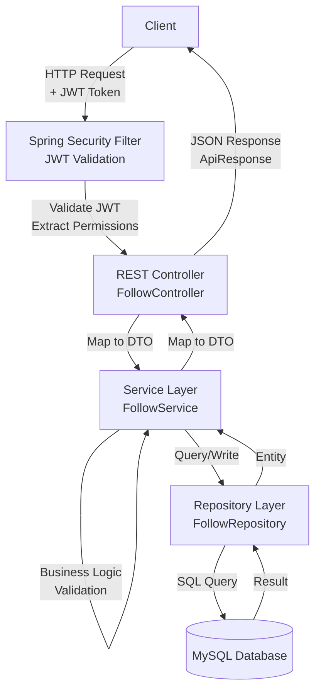
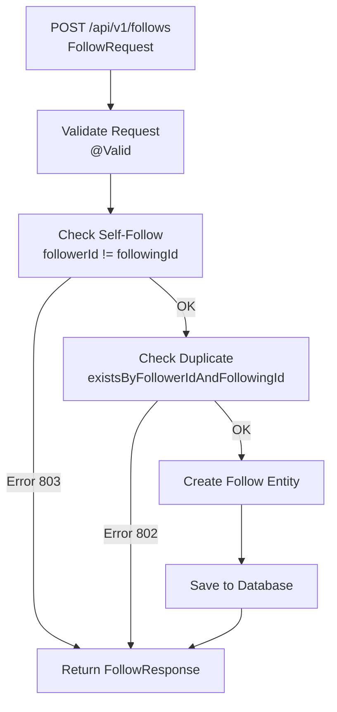
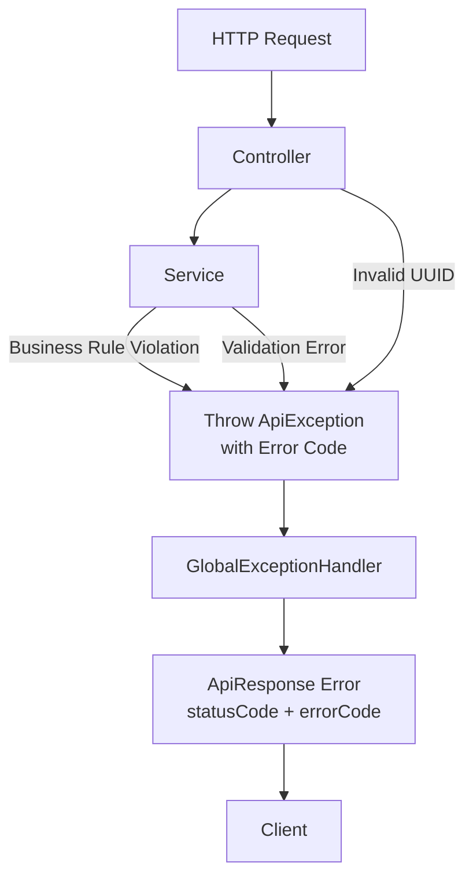
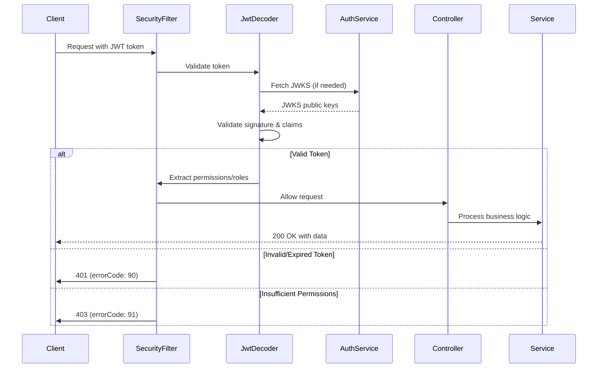
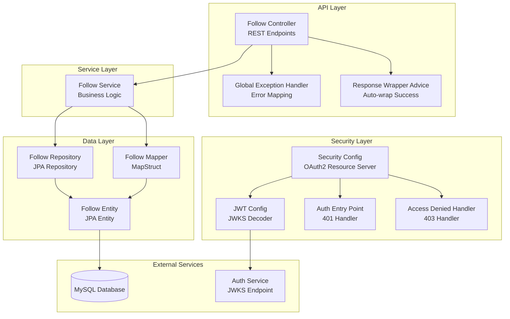

# Follower Service

**FollowerService** là microservice quản lý mối quan hệ follow giữa các user trong hệ thống **StudyDocs**.  
Dịch vụ hỗ trợ theo dõi người dùng (follow/unfollow), quản lý danh sách followers và following, đếm số lượng followers/following, và tích hợp OAuth2 JWT authentication.

---
- Port: **8089** 
- Database: MySQL (cấu hình qua environment variables)
- API base URL: `http://localhost:8089/api/v1/follows`

## 1. Giới thiệu

- **Mục đích**: Quản lý mối quan hệ follow giữa các user trong hệ thống, cho phép user theo dõi (follow) và hủy theo dõi (unfollow) các user khác.
- **Đặc điểm nổi bật**:
  - Quản lý mối quan hệ follow/unfollow giữa users
  - Lấy danh sách followers (người đang follow mình)
  - Lấy danh sách following (người mình đang follow)
  - Đếm số lượng followers và following
  - Validation business rules (không thể follow chính mình, không follow trùng lặp)
  - Error code system (800-899 range) với standardized ApiResponse
  - Tích hợp OAuth2 Resource Server với JWT authentication
  - UUID-based primary keys và foreign keys
  - Database migration với Flyway

---

## 2. Chức năng chi tiết

### Follow Management
1. **Follow một user** - Tạo mối quan hệ follow giữa follower và following user.
2. **Unfollow một user** - Xóa mối quan hệ follow (soft delete).
3. **Lấy danh sách Followers** - Lấy tất cả users đang follow một user cụ thể.
4. **Lấy danh sách Following** - Lấy tất cả users mà một user đang follow.
5. **Đếm số lượng Followers** - Đếm tổng số người đang follow một user.
6. **Đếm số lượng Following** - Đếm tổng số người mà một user đang follow.

### Business Rules & Validation
7. **Không thể follow chính mình** - Validation ngăn chặn self-follow (error code 803).
8. **Không follow trùng lặp** - Validation ngăn chặn follow duplicate (error code 802).
9. **Follow relationship không tồn tại** - Validation khi unfollow không tồn tại (error code 801).
10. **Invalid UUID format** - Validation UUID format trong request (error code 805).

### Security & Authentication
11. **JWT Authentication** - Tất cả endpoints yêu cầu JWT token hợp lệ từ auth service.
12. **OAuth2 Resource Server** - Tích hợp Spring Security OAuth2 với JWKS endpoint.
13. **Permission-based Authorization** - Hỗ trợ @PreAuthorize với permissions từ JWT claims.

---

## 3. Cấu trúc thư mục (CHỈ CẤP FOLDER — KHÔNG LIỆT KÊ FILE)

```text
src/main/java/com/example/followerservice/
├── config              → Cấu hình Security, JWT, Response Wrapper
├── controller          → REST Controllers
├── dto
│   ├── request        → Request DTOs
│   └── response       → Response DTOs
├── entity              → JPA Entities
├── exception           → Custom Exceptions, Error Codes, Global Exception Handler
├── mapper              → MapStruct Mappers (DTO ↔ Entity)
├── repository          → Spring Data JPA Repositories
├── service             → Business Logic Services
└── web                 → ApiResponse wrapper
```

---

## 4. Công nghệ & Thư viện sử dụng

| Công nghệ / Thư viện                              | Tác dụng                                           | Link tham khảo                                      |
|---------------------------------------------------|--------------------------------------------------|----------------------------------------------------|
| Spring Boot 3.2.5                                 | Framework chính, auto-configuration             | [spring.io](https://spring.io/projects/spring-boot) |
| Spring Web                                        | Xây dựng REST API                                | [spring.io](https://spring.io/projects/spring-web) |
| Spring Data JPA                                   | ORM, quản lý entity, query                       | [spring.io](https://spring.io/projects/spring-data-jpa) |
| Spring Security OAuth2 Resource Server            | JWT authentication và authorization             | [spring.io](https://spring.io/projects/spring-security) |
| MySQL                                             | Database chính (relational database)            | [mysql.com](https://www.mysql.com)                |
| Flyway                                            | Database migration và version control           | [flywaydb.org](https://flywaydb.org)              |
| MapStruct 1.5.5.Final                             | Automatic mapping giữa DTO và Entity            | [mapstruct.org](https://mapstruct.org)             |
| Lombok                                             | Giảm boilerplate (getter, setter, @RequiredArgsConstructor, ...) | [projectlombok.org](https://projectlombok.org) |
| spring-dotenv 4.0.0                               | Đọc environment variables từ .env file          | [GitHub](https://github.com/paulschwarz/spring-dotenv) |
| Hibernate                                          | JPA implementation, ORM framework                | [hibernate.org](https://hibernate.org)             |

---

## 5. Sơ đồ luồng xử lý (Architecture & Request Flow)

### 5.1. Request Flow (HTTP Request)



### 5.2. Follow User Flow



### 5.3. Get Followers/Following Flow

```mermaid
flowchart TD
    API[GET /api/v1/follows/followers/{userId}<br/>or<br/>GET /api/v1/follows/following/{userId}]
    Service[FollowService]
    Repository[FollowRepository]
    Query[Query Database<br/>findByFollowingId<br/>or<br/>findByFollowerId]
    Map[Map Entity to DTO<br/>FollowMapper]
    Response[Return List<FollowResponse>]

    API --> Service
    Service --> Repository
    Repository --> Query
    Query --> Map
    Map --> Response
```

### 5.4. Error Handling Flow



### 5.5. JWT Authentication Flow



### 5.6. Component Overview



---

## 6. Error Codes

### Follow Error Codes (800-899)
- **801**: FOLLOW_NOT_FOUND - Follow relationship không tồn tại
- **802**: ALREADY_FOLLOWING - Đã follow người này rồi
- **803**: CANNOT_FOLLOW_SELF - Không thể follow chính mình
- **805**: INVALID_UUID - UUID format không hợp lệ

### Auth Error Codes (0-99)
- **90**: ACCESS_TOKEN_INVALID_OR_EXPIRED - JWT token không hợp lệ/hết hạn
- **91**: FORBIDDEN - Không đủ quyền truy cập

### Common Error Codes (100-199, 500)
- **100**: VALIDATION_FAILED - Validation failed (@NotNull, etc.)
- **500**: INTERNAL_ERROR - Server error

---

## 7. API Endpoints

| Method | Endpoint | Description | Auth Required |
|--------|----------|-------------|---------------|
| POST | `/api/v1/follows` | Follow một user | ✅ |
| DELETE | `/api/v1/follows` | Unfollow một user | ✅ |
| GET | `/api/v1/follows/followers/{userId}` | Lấy danh sách followers | ✅ |
| GET | `/api/v1/follows/following/{userId}` | Lấy danh sách following | ✅ |
| GET | `/api/v1/follows/followers/{userId}/count` | Đếm số lượng followers | ✅ |
| GET | `/api/v1/follows/following/{userId}/count` | Đếm số lượng following | ✅ |

---

## 8. Database Schema

### Follows Table
```sql
CREATE TABLE follows (
    id CHAR(36) PRIMARY KEY,
    follower_id CHAR(36) NOT NULL,
    following_id CHAR(36) NOT NULL,
    created_at TIMESTAMP NOT NULL,
    UNIQUE KEY uk_follower_following (follower_id, following_id)
);
```

- **id**: UUID primary key (CHAR(36))
- **follower_id**: UUID của user đang follow
- **following_id**: UUID của user được follow
- **created_at**: Timestamp tự động tạo
- **Unique constraint**: Một user chỉ có thể follow một user khác một lần

---

## 9. Environment Variables

Các biến môi trường được định nghĩa trong `.env` file:

```env
# Database Configuration
DB_HOST=localhost
DB_PORT=3306
DB_NAME=follower_service_db
DB_MYSQL_USERNAME=root
DB_MYSQL_PASSWORD=your_password

# Server Configuration
SERVER_PORT=8089

# Auth Service Configuration
AUTH_SERVICE_JWKS_URL=http://localhost:8080/.well-known/jwks.json
AUTH_SERVICE_ISSUER=http://localhost:8080
```

---

## 10. Testing

### Postman Collection
File `FollowerService.postman_collection.json` chứa đầy đủ test cases:
- Success cases (6 requests)
- Error cases (6 requests)
- Complete test scenario (7 requests)

### REST Client File
File `test-api.http` để test trực tiếp trong IDE (IntelliJ/VS Code).

### Test Scenarios
1. **Basic Follow Flow**: Follow → Get followers → Unfollow → Verify
2. **Error Cases**: Self-follow, duplicate follow, invalid UUID
3. **Multiple Follows**: Follow multiple users → Count → Verify lists

---

## 11. Notes

- Tất cả endpoints yêu cầu JWT token trong header `Authorization: Bearer <token>`
- UUID được sử dụng cho tất cả IDs (primary keys và foreign keys)
- Database migration được quản lý bởi Flyway
- Error responses theo format `ApiResponse` với error codes
- JWT validation tự động qua Spring Security OAuth2 Resource Server
- JWKS được cache bởi Spring Security để tối ưu performance
