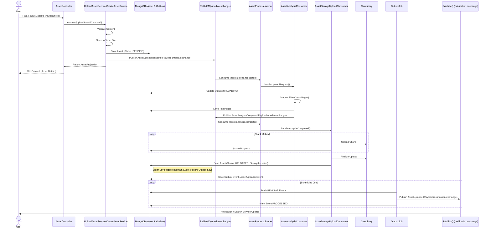

# Media Service

## 1. Giới thiệu tổng quan
Đây là service quản lý tài nguyên đa phương tiện (ảnh, video, tài liệu) trong hệ thống StudyDocs.
Nó đóng vai trò:
- **Lưu trữ và quản lý tập tin** (tích hợp Cloudinary)
- **Tải lên và xử lý tập tin** (Validation, Resize, Format check)
- **Cung cấp URL truy cập và download**
- **Đồng bộ trạng thái** thông qua Event-Driven Architecture

> Service đang chạy tại **port `8084`**.

---

## 2. Chức năng chi tiết

### Quản lý Asset (Tài sản)
- **Upload Asset** → Tải lên tài liệu mới với validation định dạng và kích thước (multipart/form-data)
- **Lấy thông tin Asset** → Truy xuất metadata của tài liệu (tên, kích thước, contentType...)
- **Lấy URL Download** → Tạo URL tải xuống (có thể là signed URL hoặc direct URL)
- **Lấy URL Preview** → Tạo URL xem trước tài liệu
- **Xóa Asset** → Xóa mềm metadata trong DB và xóa vật lý file trên Cloudinary

### Xử lý sự kiện (Event Driven)
- **Publish sự kiện Upload thành công** → Gửi message `AssetUploadedPayload` tới RabbitMQ để các service khác (Notification, Search) xử lý
- **Publish sự kiện Upload thất bại** → Gửi message lỗi để trigger cơ chế cleanup
- **Asset Cleanup Consumer** → Lắng nghe sự kiện lỗi và đảm bảo file rác được xóa khỏi Storage

### Cơ chế đảm bảo nhất quán (Consistency & Concurrency)
- **Transactional Outbox** → Đảm bảo sự kiện domain luôn được gửi đi ngay cả khi message broker gặp sự cố tạm thời
- **Retry Mechanism** → Tự động thử lại các job thất bại
- **Distributed Lock** → Sử dụng **ShedLock** và annotation `@DistributableJobLock` để đảm bảo chỉ có một instance chạy job Outbox tại một thời điểm (tránh duplicate processing).

---

## 3. Cấu trúc thư mục

```bash
media-service/
├── api/                           # Lớp API - Controllers và Exception Handling (Không phụ thuộc vào Infrastructure)
│   ├── dto/                       # Request/Response DTOs
│   ├── exception/                 # Global Exception Handler
│   ├── helper/                    # Helpers (Mapper, Executor)
│   ├── job/                       # Outbox Job Definitions
│   ├── mapper/                    # API Mappers
│   └── web/                       # REST Controllers
├── application/                   # Lớp ứng dụng - Use Cases và Business Logic
│   ├── annotation/                # Custom Annotations (ví dụ: @DistributableJobLock)
│   ├── config/                    # Application configs
│   ├── dto/                       # Application DTOs (Command, Query, Payload)
│   ├── exception/                 # Application Exceptions
│   ├── helper/                    # Business helpers (PageCounter)
│   ├── port/                      # Ports (Input/Output Interfaces)
│   │   ├── in/                    # Input Ports (Use Cases)
│   │   └── out/                   # Output Ports (Storage, Repository, Messaging)
│   └── service/                   # Use Case Implementations
├── domain/                        # Lớp domain - Core Business Rules
│   ├── aggregate/                 # Domain Aggregates (Asset)
│   ├── enums/                     # Domain Enums
│   ├── event/                     # Domain Events
│   ├── exception/                 # Domain Exceptions
│   ├── policy/                    # Domain Policies (Validation)
│   ├── repository/                # Repository Interfaces
│   ├── service/                   # Domain Services
│   └── vo/                        # Value Objects
├── infrastructure/                # Lớp hạ tầng - Implementations
│   ├── adapter/                   # Adapters
│   │   ├── bus/                   # Internal Bus (Mediator)
│   │   ├── messaging/             # RabbitMQ Producers/Consumers
│   │   ├── repository/            # MongoDB Repositories
│   │   ├── storage/               # Cloudinary Implementation
│   │   └── url/                   # URL Generation Implementation
│   ├── aspect/                    # AOP Aspects (DistributedLockAspect)
│   ├── config/                    # Infrastructure Configs (Mongo, Rabbit, Cloudinary, ShedLock)
│   ├── job/                       # Scheduled Jobs (Implementation details)
│   └── persistence/               # DB Entities
├── launcher/                      # Entry point (Main application)
└── shared/                        # Common utilities
    └── web/                       # Shared Web components (ApiResponse, HttpException)
```

---

## 4. Công nghệ sử dụng

- **Spring Boot 3** - Framework chính
- **MongoDB** - Database lưu trữ metadata và outbox events
- **RabbitMQ** - Message broker cho xử lý bất đồng bộ
- **Cloudinary** - Cloud Storage service để lưu trữ file vật lý
- **ShedLock** - Thư viện Distributed Lock (dùng MongoDB)
- **Spring AOP** - Aspect Oriented Programming (để xử lý Lock annotation)
- **Gradle** - Build tool (Multi-module Architecture)
- **Docker** - Containerization
- **Clean Architecture** - Kiến trúc phần mềm áp dụng

---

## 5. Cấu hình môi trường

### Biến môi trường cần thiết:
- `MAX_FILE_SIZE` - Kích thước file tối đa (ví dụ: 10MB)
- `MAX_REQUEST_SIZE` - Kích thước request tối đa
- `MONGODB_URI` - Connection string tới MongoDB
- `RABBIT_HOST` - Host RabbitMQ
- `RABBIT_PORT` - Port RabbitMQ (thường là 5672)
- `RABBIT_USERNAME` - Username RabbitMQ
- `RABBIT_PASSWORD` - Password RabbitMQ
- `RABBIT_VIRTUAL_HOST` - Virtual host RabbitMQ
- `RABBIT_SSL` - Bật/tắt SSL cho RabbitMQ
- `CLOUDINARY_CLOUD_NAME` - Cloud name tài khoản Cloudinary
- `CLOUDINARY_API_KEY` - API Key Cloudinary
- `CLOUDINARY_API_SECRET` - API Secret Cloudinary
- `ERROR_CODE` - Base error code cho service
- `SCHEDULE_DELAY` - Delay cho Outbox Job
- `BATCH_SIZE` - Số lượng event xử lý mỗi batch

### Debugging & Logging
Để bật log DEBUG cho cơ chế Distributed Lock (xem job nào bị skip hoặc acquired lock), bạn có thể set biến môi trường sau khi chạy Docker hoặc file JAR:

```bash
LOGGING_LEVEL_STUDYDOCS_MEDIA_INFRASTRUCTURE_ASPECT_DISTRIBUTEDLOCKASPECT=DEBUG
```

Hoặc set cho toàn bộ package infrastructure:
```bash
LOGGING_LEVEL_STUDYDOCS_MEDIA_INFRASTRUCTURE=DEBUG
```

---

## 6. Chạy với Docker

### Yêu cầu
- Docker
- Docker Compose

### Các bước
1. Build file JAR:
   ```bash
   ./gradlew clean build -x test
   ```
2. Chạy Docker Compose
   ```bash
   docker-compose up -d
   ```
   
Service sẽ khởi động tại `http://localhost:8084`.

---

## 7. Mã lỗi (Error Codes)
Danh sách các mã lỗi chi tiết được định nghĩa tại file [ERROR_CODES.md](ERROR_CODES.md).

---

## 8. Danh sách Sự kiện (Events)

### Topology (RabbitMQ)

#### 1. External Exchange
- **Name:** `notification.exchange`
- **Type:** `TopicExchange`
- **Purpose:** Giao tiếp với các service bên ngoài (Notification, Search).

| Tên Sự kiện (Payload) | Routing Key | Queue Name | Mô tả |
| :--- | :--- | :--- | :--- |
| `AssetUploadedPayload` | `upload.completed` | `upload.completed.notification.queue` | Bắn ra khi file được upload thành công. |

#### 2. Internal Exchange
- **Name:** `media.exchange`
- **Type:** `TopicExchange`
- **Purpose:** Xử lý sự kiện nội bộ, lỗi, hoặc giao tiếp nghiệp vụ bên trong domain.

| Tên Sự kiện (Payload) | Routing Key | Queue Name | Mô tả |
| :--- | :--- | :--- | :--- |
| `AssetUploadFailedPayload` | `asset.upload.failed` | `asset.cleanup.queue` | Bắn ra khi upload lỗi, trigger xóa file rác. |
| `AssetUploadRequestedPayload` | `asset.upload.requested` | `asset.upload.requested.queue` | Yêu cầu upload từ service khác. |
| `AssetAnalysisCompletedPayload` | `asset.analysis.completed` | `asset.analysis.completed.queue` | Kết quả phân tích file (AI/Security). |
| `AssetDeletionFailedPayload` | `asset.deletion.failed` | `asset.deletion.failed.queue` | Báo lỗi khi xóa file thất bại. |

### Event Flow Diagram

```mermaid
graph TD
    MediaService[Media Service]
    NotificationExchange{notification.exchange}
    MediaExchange{media.exchange}
    
    %% Queues
    Q1(upload.completed.notification.queue)
    Q2(asset.cleanup.queue)
    Q3(asset.upload.requested.queue)
    Q4(asset.analysis.completed.queue)
    Q5(asset.deletion.failed.queue)
    
    %% External Flow
    MediaService -- Publish: upload.completed --> NotificationExchange
    NotificationExchange -- Routing: upload.completed --> Q1
    
    %% Internal Flow
    MediaService -- Publish: asset.upload.failed --> MediaExchange
    MediaExchange -- Routing: asset.upload.failed --> Q2
    
    %% Consumers (External)
    Q1 -.-> NotificationService[Notification Service]
    Q1 -.-> SearchService[Search Service]
    
    %% Consumers (Internal/System)
    Q2 -.-> MediaServiceCleanup[Media Service (Cleanup Job)]
    
    %% Incoming Internal/System
    ExternalService[External Service] -- Publish --> MediaExchange
    MediaExchange -- Routing: asset.upload.requested --> Q3
    Q3 -.-> MediaService
    

    AI_Service[AI Service] -- Publish --> MediaExchange
    MediaExchange -- Routing: asset.analysis.completed --> Q4
    Q4 -.-> MediaService
```

### 9. Luồng nghiệp vụ chính (Main Flow: Upload Asset)
Dưới đây là sơ đồ luồng xử lý chi tiết cho nghiệp vụ Upload Asset, bao gồm cả xử lý đồng bộ và bất đồng bộ (Async).



> **Lưu ý:** Tất cả các sự kiện **Publish** đều đi qua cơ chế **Transactional Outbox** để đảm bảo tính toàn vẹn dữ liệu (không bao giờ mất event dù DB commit thành công mà Broker sập).

---

## 10. Định dạng Response (Standard API Response)

Service áp dụng cơ chế **Global Response Wrapping** (thông qua `GlobalResponseBodyAdvice`). Mọi API thành công sẽ tự động trả về định dạng chuẩn `ApiResponse`:

```json
{
  "statusCode": 200,
  "errorCode": null,
  "data": {
    // Dữ liệu thực tế trả về từ Controller
    "id": "...",
    "fileName": "..."
  },
  "traceId": "69fe4356-bdd7-..."
}
```

- **Controller chỉ cần trả về POJO/Entity/DTO**.
- **Không cần wrap thủ công** `ResponseEntity` hay `ApiResponse`.
- **Status Code**: Dùng annotation `@ResponseStatus` trên method controller nếu muốn trả về code khác 200 (ví dụ `201 Created`).


