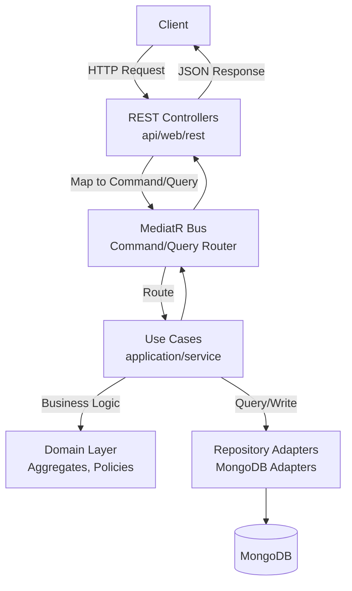
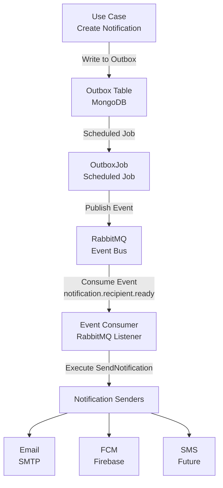
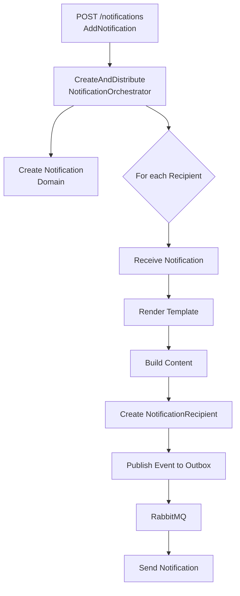
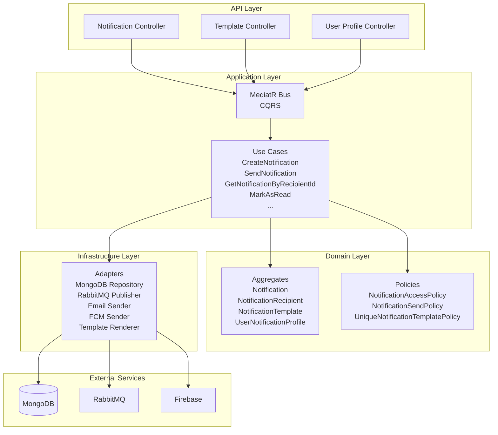

# Notification Service

**NotificationService** là microservice quản lý thông báo trong hệ thống **StudyDocs**.  
Dịch vụ hỗ trợ gửi thông báo đa kênh (Email, SMS, Push), quản lý template, profile người dùng, tích hợp RabbitMQ cho event-driven messaging, và sẵn sàng tích hợp OAuth2 JWT.

---
- Port: **8087** 
- Database: MongoDB (cấu hình qua environment variables)
- API base URL: `http://localhost:8087/api/v1/notifications`

## 1. Giới thiệu

- **Mục đích**: Quản lý vòng đời thông báo và phân phối thông báo qua nhiều kênh (Email, SMS, Push Notification) cho người dùng trong hệ thống.
- **Đặc điểm nổi bật**:
  - Hỗ trợ 3 kênh thông báo: `EMAIL`, `SMS`, `PUSH` (Firebase Cloud Messaging)
  - Template-based notification với template rendering động
  - Event-driven architecture với RabbitMQ (Outbox pattern)
  - Quản lý user notification profile và preferences
  - Cursor-based pagination cho danh sách thông báo
  - Soft delete và hard delete
  - Đánh dấu đã đọc/chưa đọc
  - Sẵn sàng tích hợp OAuth2 Resource Server với JWT (hiện tại permitAll)

---

## 2. Chức năng chi tiết

### Notification Management
1. Tạo thông báo mới với template và danh sách người nhận.
2. Lấy danh sách thông báo theo recipient ID (cursor pagination).
3. Đếm số thông báo chưa đọc.
4. Đánh dấu một thông báo là đã đọc.
5. Đánh dấu tất cả thông báo là đã đọc.
6. Nhận thông báo (receive) - tạo notification recipient với rendered content.
7. Khôi phục thông báo đã xóa (restore).
8. Xóa mềm thông báo (soft delete).
9. Xóa cứng thông báo (hard delete).
10. Lấy metadata thông báo.

### Template Management
11. Tạo template mới với channel, subject, body.
12. Lấy tất cả template.
13. Lấy template theo channel.
14. Tìm kiếm template theo tên.
15. Cập nhật tên template.
16. Cập nhật subject template.
17. Cập nhật body template.
18. Cập nhật description template.

### User Notification Profile Management
19. Tạo user notification profile.
20. Lấy thông tin profile của user hiện tại.
21. Cập nhật email trong profile.
22. Cập nhật số điện thoại trong profile.
23. Đăng ký FCM token cho push notification.
24. Xóa FCM token.
25. Cập nhật notification preferences (push/email/sms enabled).

### Integration & Messaging
26. Nhận event từ RabbitMQ: `notification.recipient.ready` → gửi thông báo.
27. Nhận event từ RabbitMQ: `upload.completed` → tạo thông báo tự động.
28. Outbox pattern để đảm bảo eventual consistency.
29. Phát thông báo qua Email
30. Phát thông báo qua FCM
---

## 3. Cấu trúc thư mục (CHỈ CẤP FOLDER — KHÔNG LIỆT KÊ FILE)

```text
src/main/java/studydocs/notification/
├── api
│   ├── config              → Cấu hình Security, CORS
│   ├── dto                 → Request/Response DTOs
│   ├── exception           → Global exception handler
│   ├── helper              → RequestExecutor, utilities
│   ├── mapper              → DTO ↔ Command/Query mapper
│   └── web
│       ├── filter          → TraceIdFilter
│       └── rest            → REST Controllers
├── application
│   ├── config              → Domain policy, data provider config
│   ├── dto                 → Command, Query, Projection, Payload
│   ├── port
│   │   ├── in              → Use case interfaces, providers, renderer
│   │   └── out             → Repository, messaging, remote service ports
│   └── service
│       ├── builder         → NotificationContentBuilder, TemplateContentBuilder
│       ├── orchestrator    → CreateAndDistributeNotificationOrchestrator
│       └── usecase         → Implementation các use case
├── domain
│   ├── aggregate           → Notification, NotificationRecipient, Template, UserProfile, FcmToken
│   ├── enums               → NotificationChannel, DomainErrorCode, DomainErrorCategory
│   ├── event               → Domain events
│   ├── exception           → Domain exceptions
│   ├── policy              → Business policies (Access, Send, Unique)
│   ├── repository          → Domain repository interfaces
│   ├── service             → Policy implementations
│   └── vo                  → Value objects (NotificationChannel, TemplateName, etc.)
├── infrastructure
│   ├── adapter
│   │   ├── bus             → MediatR handlers
│   │   ├── messaging       → RabbitMQ consumer/publisher, notification senders
│   │   ├── provider        → JWT providers, data providers
│   │   ├── registry        → Domain event registry
│   │   ├── remote          → Remote service adapters
│   │   ├── renderer        → Template renderer
│   │   ├── repository      → MongoDB adapters (query/write)
│   │   ├── serializer      → ObjectMapper adapter
│   │   └── web             → Exception mapper, interceptors
│   ├── config              → RabbitMQ, MongoDB, Firebase, Email, Bus config
│   ├── job                 → OutboxJob (scheduled job)
│   ├── mapper              → Entity ↔ Domain mapper
│   ├── messaging           → FirebaseMessagingService
│   └── persistence
│       ├── entity          → MongoDB entities
│       └── repository      → Spring Data MongoDB repositories
└── bootstrap               → Application entry point, application.yaml
```

---

## 4. Công nghệ & Thư viện sử dụng

| Công nghệ / Thư viện                              | Tác dụng                                           | Link tham khảo                                      |
|---------------------------------------------------|--------------------------------------------------|----------------------------------------------------|
| Spring Boot 3.5.3                                 | Framework chính, auto-configuration             | [spring.io](https://spring.io/projects/spring-boot) |
| Spring Web                                        | Xây dựng REST API                                | [spring.io](https://spring.io/projects/spring-web) |
| Spring Data MongoDB                               | ODM, quản lý document, query                     | [spring.io](https://spring.io/projects/spring-data-mongodb) |
| Spring AMQP (RabbitMQ)                            | Message broker cho event-driven messaging        | [spring.io](https://spring.io/projects/spring-amqp) |
| Spring Mail                                        | Gửi email qua SMTP                               | [spring.io](https://spring.io/projects/spring-framework) |
| Spring Security                                   | Bảo mật (sẵn sàng OAuth2 Resource Server)        | [spring.io](https://spring.io/projects/spring-security) |
| Firebase Admin SDK                                | Gửi push notification qua FCM                    | [firebase.google.com](https://firebase.google.com/docs/cloud-messaging) |
| MongoDB                                           | Database chính (NoSQL document store)            | [mongodb.com](https://www.mongodb.com)            |
| RabbitMQ                                          | Message broker cho async messaging               | [rabbitmq.com](https://www.rabbitmq.com)          |
| Lombok                                            | Giảm boilerplate (getter, setter, @RequiredArgsConstructor, ...) | [projectlombok.org](https://projectlombok.org) |
| MediatR (Custom)                                  | CQRS pattern, command/query separation           | [GitHub](https://github.com/minhhien-e/MediatR) |
| Foundation Domain (Custom)                        | DDD foundation (AggregateRoot, ValueObject)      | [GitHub](https://github.com/minhhien-e/foundation-domain) |

---

## 5. Sơ đồ luồng xử lý (Architecture & Request Flow)

### 5.1. Request Flow (HTTP Request)



### 5.2. Event-Driven Flow (RabbitMQ)



### 5.3. Notification Distribution Flow



### 5.4. Component Overview



